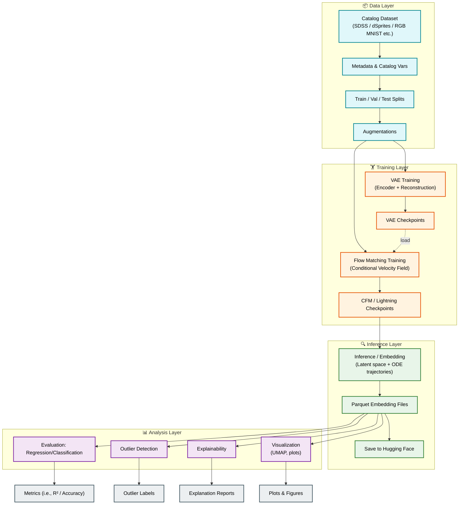

```mermaid
graph TD

    subgraph Data["📦 Data Layer"]
        D1["Catalog Dataset<br/>(SDSS / dSprites / RGB MNIST etc.)"]
        D2["Metadata & Catalog Vars"]
        D3["Train / Val / Test Splits"]
        D4["Augmentations"]
    end

    subgraph Train["🏋️ Training Layer"]
        T1["VAE Training<br/>(Encoder + Reconstruction)"]
        T1a["VAE Checkpoints"]
        T2["Flow Matching Training<br/>(Conditional Velocity Field)"]
        T2a["CFM / Lightning Checkpoints"]
    end

    subgraph Inference["🔍 Inference Layer"]
        I1["Inference / Embedding<br/>(Latent space + ODE trajectories)"]
        I2["Parquet Embedding Files"]
        I3["Save to Hugging Face"]
    end

    subgraph Analysis["📊 Analysis Layer"]
        A1["Evaluation: Regression/Classification"]
        A4["Outlier Detection"]
        A5["Explainability"]
        A6["Visualization<br/>(UMAP, plots)"]
    end

    D1 --> D2
    D2 --> D3
    D3 --> D4
    D4 --> T1

    D4 --> T2

    T1 --> T1a
    T1a -.->|"load"| T2

    T2 --> T2a

    T2a --> I1
    I1 --> I2
    I2 --> I3

    I2 --> A1
    I2 --> A4
    I2 --> A5
    I2 --> A6

    A1 --> B2["Metrics (i.e., R² / Accuracy)"]
    A4 --> B4["Outlier Labels"]
    A5 --> B5["Explanation Reports"]
    A6 --> B6["Plots & Figures"]

    %% Styling
    classDef data fill:#e0f7fa,stroke:#00838f,stroke-width:2px,color:#000
    classDef train fill:#fff3e0,stroke:#e65100,stroke-width:2px,color:#000
    classDef inf fill:#e8f5e9,stroke:#2e7d32,stroke-width:2px,color:#000
    classDef ana fill:#f3e5f5,stroke:#7b1fa2,stroke-width:2px,color:#000
    classDef out fill:#eceff1,stroke:#455a64,stroke-width:2px,color:#000

    class D1,D2,D3,D4 data
    class T1,T1a,T2,T2a train
    class I1,I2,I3 inf
    class A1,A2,A3,A4,A5,A6 ana
    class B1,B2,B3,B4,B5,B6 out
```
